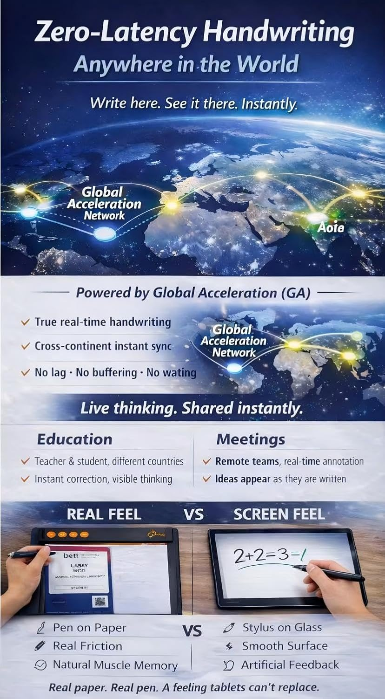
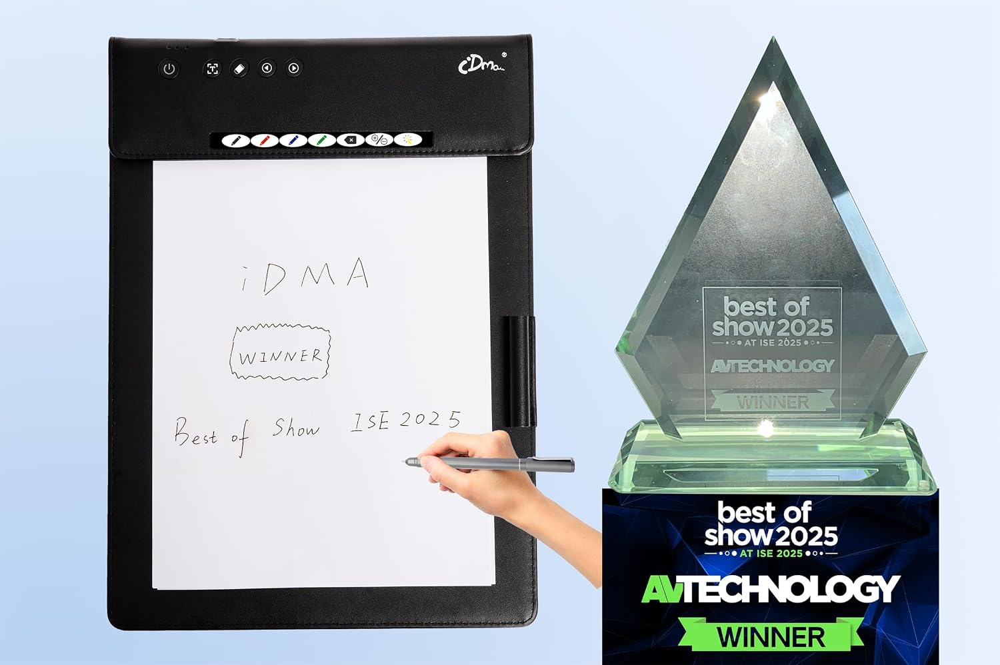
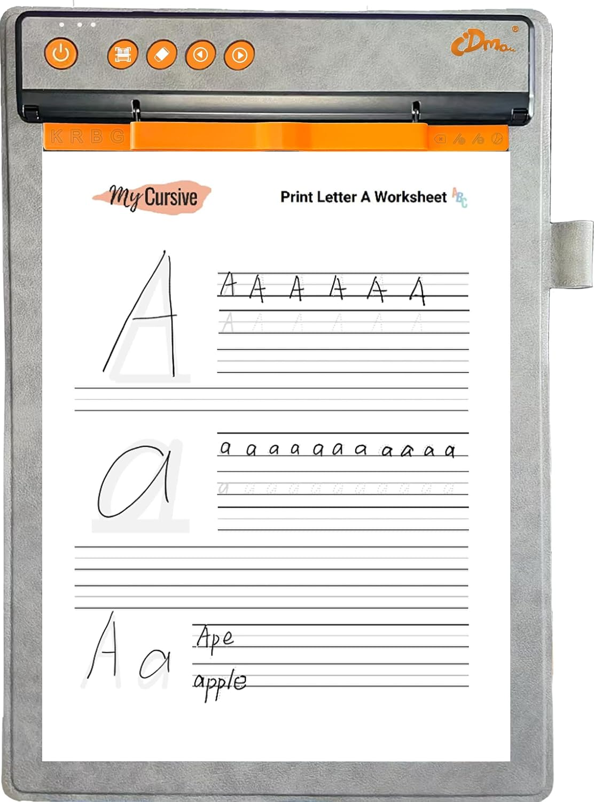
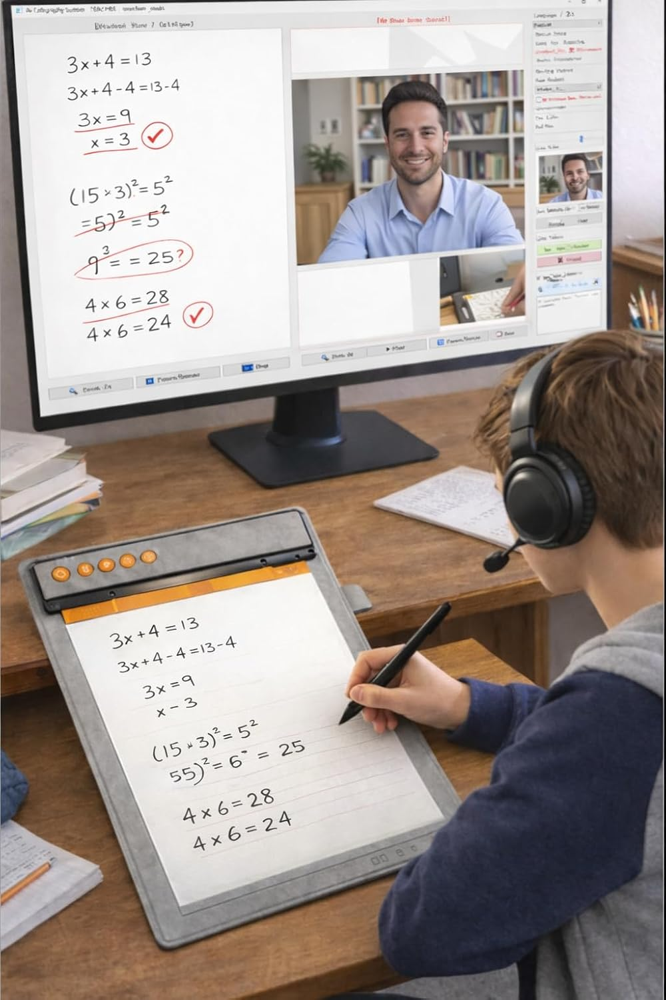
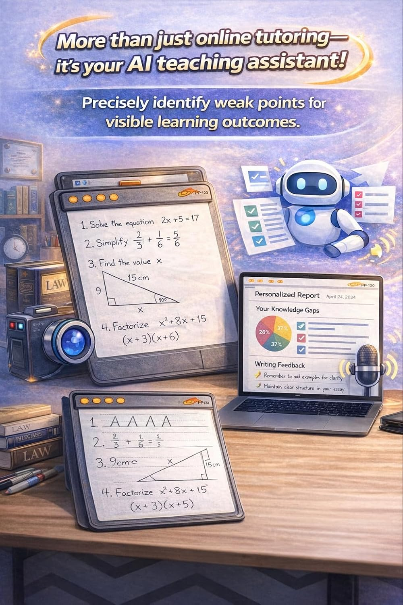

# Amazon Product Image Library

[Back to resource center](../../README.md) | [All assets](../../ASSET_GUIDE.md)

Retrieved September 8, 2026. These are the product gallery images served by Amazon.com for the three listings linked from the [IDMA shop](https://www.idma.ai/en/shop). Downloaded image bytes are unchanged.

[Download all 18 images as a ZIP](https://raw.githubusercontent.com/wuxiaolong1117/assets-for-IDMA/main/Images/Amazon/IDMA_Amazon_Images_2026-09-08.zip)

## Models and sources

| Model | B&H item code | Amazon listing | Images |
| --- | --- | --- | --- |
| PP-100 | IDPP100 | [B0F8MZT8FP](https://www.amazon.com/dp/B0F8MZT8FP) | 8 |
| PP-110 | IDPP110 | [B0GLY43L6L](https://www.amazon.com/dp/B0GLY43L6L) | 4 |
| PP-120 | IDPP120 | [B0GMDMRZCJ](https://www.amazon.com/dp/B0GMDMRZCJ) | 6 |

## Image requirements

Fifteen images are at least 1000 pixels wide and 1000 pixels high. Three fall below that pixel threshold and are marked below. None of the downloaded JPEGs contains DPI metadata, so these files are not certified as meeting the separate 300-ppi request. No resizing, retouching, or metadata changes have been applied.

These are Amazon gallery assets, including product and promotional imagery. Listing presence does not independently validate feature claims, packaging, or configuration shown in an image. This import covers the three notebook listings only, not dedicated gateway, software, HEM-100, or bundle images.

## Browse and download

Image numbers follow the observed Amazon gallery order. Click a filename to preview the full image or use Download for the file.

### PP-100

| Preview | File | Pixels (width × height) | Both sides ≥1000 px |
| --- | --- | --- | --- |
|  | [PP-100_Amazon_01.jpg](PP-100/PP-100_Amazon_01.jpg) · [Download](https://raw.githubusercontent.com/wuxiaolong1117/assets-for-IDMA/main/Images/Amazon/PP-100/PP-100_Amazon_01.jpg) | 1000 × 1500 | Yes |
|  | [PP-100_Amazon_02.jpg](PP-100/PP-100_Amazon_02.jpg) · [Download](https://raw.githubusercontent.com/wuxiaolong1117/assets-for-IDMA/main/Images/Amazon/PP-100/PP-100_Amazon_02.jpg) | 1500 × 1000 | Yes |
|  | [PP-100_Amazon_03.jpg](PP-100/PP-100_Amazon_03.jpg) · [Download](https://raw.githubusercontent.com/wuxiaolong1117/assets-for-IDMA/main/Images/Amazon/PP-100/PP-100_Amazon_03.jpg) | 1000 × 1500 | Yes |
|  | [PP-100_Amazon_04.jpg](PP-100/PP-100_Amazon_04.jpg) · [Download](https://raw.githubusercontent.com/wuxiaolong1117/assets-for-IDMA/main/Images/Amazon/PP-100/PP-100_Amazon_04.jpg) | 1000 × 1500 | Yes |
|  | [PP-100_Amazon_05.jpg](PP-100/PP-100_Amazon_05.jpg) · [Download](https://raw.githubusercontent.com/wuxiaolong1117/assets-for-IDMA/main/Images/Amazon/PP-100/PP-100_Amazon_05.jpg) | 1000 × 1500 | Yes |
|  | [PP-100_Amazon_06.jpg](PP-100/PP-100_Amazon_06.jpg) · [Download](https://raw.githubusercontent.com/wuxiaolong1117/assets-for-IDMA/main/Images/Amazon/PP-100/PP-100_Amazon_06.jpg) | 828 × 1500 | No — smaller source image |
|  | [PP-100_Amazon_07.jpg](PP-100/PP-100_Amazon_07.jpg) · [Download](https://raw.githubusercontent.com/wuxiaolong1117/assets-for-IDMA/main/Images/Amazon/PP-100/PP-100_Amazon_07.jpg) | 1500 × 998 | No — smaller source image |
|  | [PP-100_Amazon_08.jpg](PP-100/PP-100_Amazon_08.jpg) · [Download](https://raw.githubusercontent.com/wuxiaolong1117/assets-for-IDMA/main/Images/Amazon/PP-100/PP-100_Amazon_08.jpg) | 1500 × 1037 | Yes |

### PP-110

| Preview | File | Pixels (width × height) | Both sides ≥1000 px |
| --- | --- | --- | --- |
|  | [PP-110_Amazon_01.jpg](PP-110/PP-110_Amazon_01.jpg) · [Download](https://raw.githubusercontent.com/wuxiaolong1117/assets-for-IDMA/main/Images/Amazon/PP-110/PP-110_Amazon_01.jpg) | 1500 × 1000 | Yes |
|  | [PP-110_Amazon_02.jpg](PP-110/PP-110_Amazon_02.jpg) · [Download](https://raw.githubusercontent.com/wuxiaolong1117/assets-for-IDMA/main/Images/Amazon/PP-110/PP-110_Amazon_02.jpg) | 864 × 1216 | No — smaller source image |
|  | [PP-110_Amazon_03.jpg](PP-110/PP-110_Amazon_03.jpg) · [Download](https://raw.githubusercontent.com/wuxiaolong1117/assets-for-IDMA/main/Images/Amazon/PP-110/PP-110_Amazon_03.jpg) | 1000 × 1500 | Yes |
|  | [PP-110_Amazon_04.jpg](PP-110/PP-110_Amazon_04.jpg) · [Download](https://raw.githubusercontent.com/wuxiaolong1117/assets-for-IDMA/main/Images/Amazon/PP-110/PP-110_Amazon_04.jpg) | 1000 × 1500 | Yes |

### PP-120

| Preview | File | Pixels (width × height) | Both sides ≥1000 px |
| --- | --- | --- | --- |
|  | [PP-120_Amazon_01.jpg](PP-120/PP-120_Amazon_01.jpg) · [Download](https://raw.githubusercontent.com/wuxiaolong1117/assets-for-IDMA/main/Images/Amazon/PP-120/PP-120_Amazon_01.jpg) | 1112 × 1500 | Yes |
|  | [PP-120_Amazon_02.jpg](PP-120/PP-120_Amazon_02.jpg) · [Download](https://raw.githubusercontent.com/wuxiaolong1117/assets-for-IDMA/main/Images/Amazon/PP-120/PP-120_Amazon_02.jpg) | 1000 × 1500 | Yes |
|  | [PP-120_Amazon_03.jpg](PP-120/PP-120_Amazon_03.jpg) · [Download](https://raw.githubusercontent.com/wuxiaolong1117/assets-for-IDMA/main/Images/Amazon/PP-120/PP-120_Amazon_03.jpg) | 1000 × 1500 | Yes |
|  | [PP-120_Amazon_04.jpg](PP-120/PP-120_Amazon_04.jpg) · [Download](https://raw.githubusercontent.com/wuxiaolong1117/assets-for-IDMA/main/Images/Amazon/PP-120/PP-120_Amazon_04.jpg) | 1000 × 1500 | Yes |
|  | [PP-120_Amazon_05.jpg](PP-120/PP-120_Amazon_05.jpg) · [Download](https://raw.githubusercontent.com/wuxiaolong1117/assets-for-IDMA/main/Images/Amazon/PP-120/PP-120_Amazon_05.jpg) | 1000 × 1500 | Yes |
|  | [PP-120_Amazon_06.jpg](PP-120/PP-120_Amazon_06.jpg) · [Download](https://raw.githubusercontent.com/wuxiaolong1117/assets-for-IDMA/main/Images/Amazon/PP-120/PP-120_Amazon_06.jpg) | 1000 × 1500 | Yes |

## File provenance

[Source manifest](sources.json) records the Amazon page, CDN image URL, gallery position, dimensions, download date, and SHA-256 checksum for each image. Original filename-to-ASIN mapping is retained there. The ZIP includes the images and this provenance record, without the procurement workbook.
