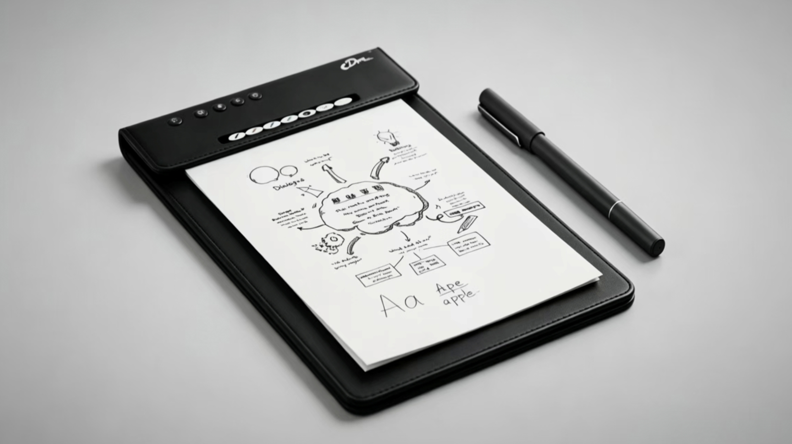
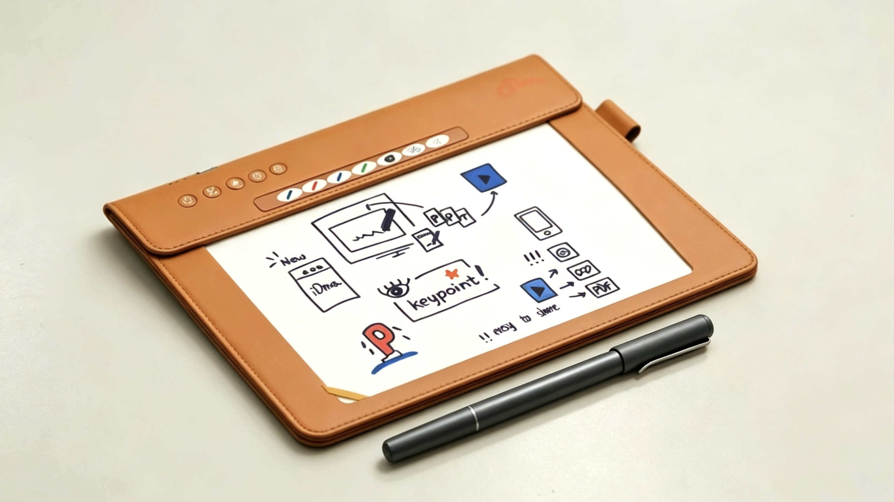
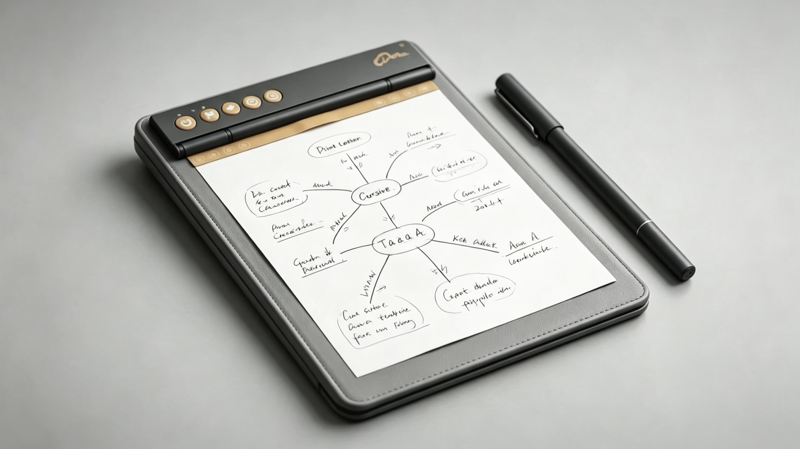
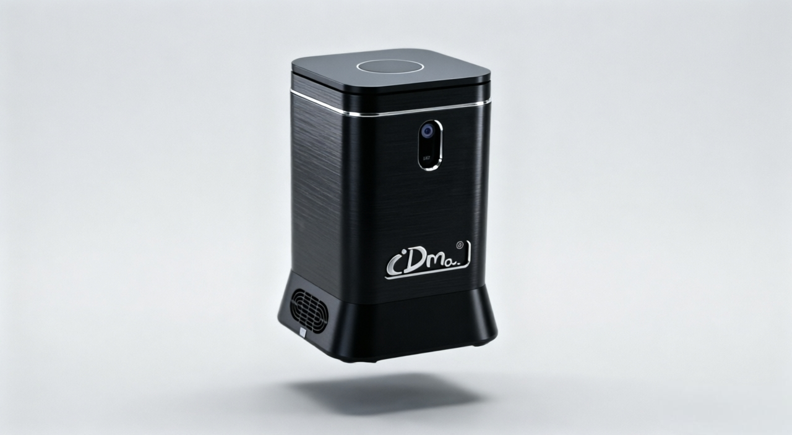
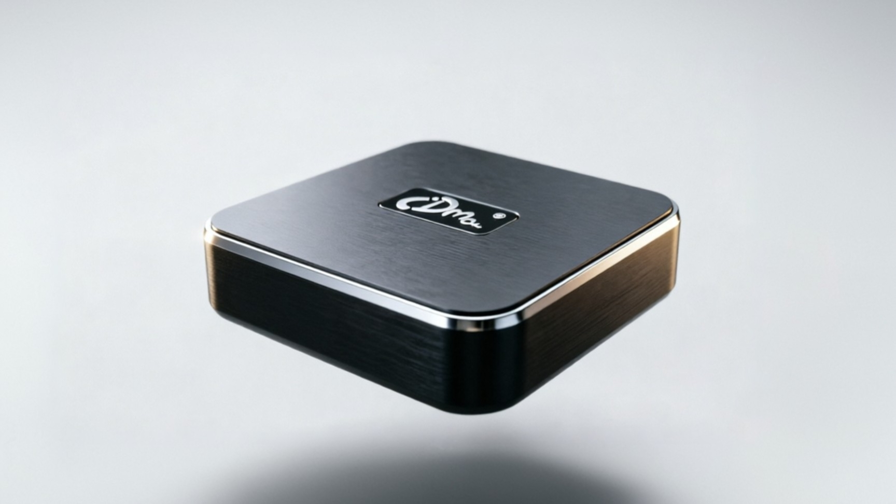
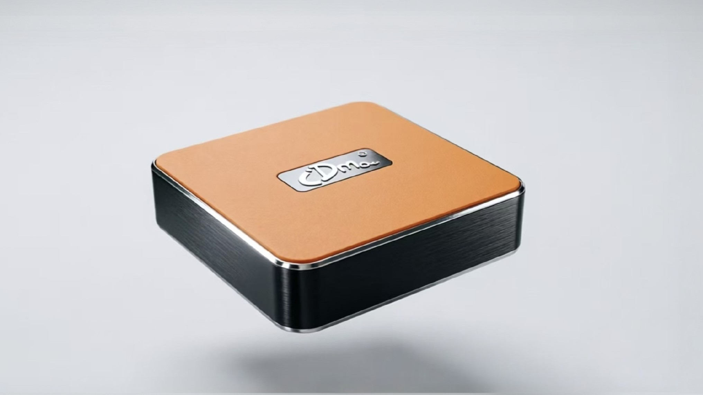

# iDma Partner Resource Center

Product information, images, brand assets, and demonstration videos for U.S. partner evaluation and merchandising.

iDma brings paper-based handwriting into meeting, teaching, and collaboration workflows. Explore the notebook and gateway lineup below, then use the source workbooks for detailed product and item setup information.

**Updated September 8, 2026** · IDMA INTERNATIONAL LTD

## Start here

| What you need | Resource |
| --- | --- |
| Understand the products | [Product overview and comparison](Documents/PRODUCT_OVERVIEW.md) |
| Get the images used on Amazon | [Amazon image library: PP-100, PP-110, PP-120](Images/Amazon/README.md) |
| Download images, logos, or videos | [Asset guide and direct downloads](ASSET_GUIDE.md) |
| Review product specifications | [Product specification workbook](Documents/IDMA_BH_Product_Spec_Sheet%2020260908.xlsx) |
| Work on B&H item setup | [Procurement guide](Documents/PARTNER_SETUP.md) · [Item master workbook](Documents/IDMA_BH_Item_Master_2026_v1.0.xlsx) |
| Download the entire resource library | [Download ZIP](https://github.com/wuxiaolong1117/assets-for-IDMA/archive/refs/heads/main.zip) |

## Notebook lineup

| PP-100 | PP-110 | PP-120 |
| --- | --- | --- |
|  |  |  |
| Vertical, leather | Horizontal A4, leather | Vertical, polymer |
| Meetings and note capture | Desktop annotation and presentations | Teaching and remote tutoring |

See the [product overview](Documents/PRODUCT_OVERVIEW.md) for writing-area behavior, included accessories, and source references.

## Gateway lineup

| GW-210 / Lite | GW-400 / Pro | GW-500 / Max |
| --- | --- | --- |
|  |  |  |
| Screencasting and local collaboration | Hybrid meeting-room collaboration | Large-room collaboration |
| Listed in the item master; setup pending | Listed in the item master; setup pending | Specification reference only; not in the current item master |

The gateway aliases follow the specification workbook. The asset guide identifies the supplied image files and their limitations.

## Using this library

Browse any guide directly on GitHub. For an individual Excel file or video, open its file page and use **Download raw file** if a preview is unavailable. The [asset guide](ASSET_GUIDE.md) also provides direct download links.

For a complete local copy:

```bash
git clone https://github.com/wuxiaolong1117/assets-for-IDMA.git
```

The main branch contains the latest materials. To refer to an exact revision, open **History**, select the relevant commit, and copy its link.

## Product and procurement status

Product descriptions summarize the supplied specification workbook. They do not establish order availability or completed retailer approval. The B&H item master contains 21 records, including 11 bundles, with open setup and approval items. **GW-500 / Max is not included in that assortment.** Review [partner setup notes](Documents/PARTNER_SETUP.md) before item activation or purchase-order preparation.

## Contact

**IDMA INTERNATIONAL LTD**

General inquiries: [contact@idma.ai](mailto:contact@idma.ai)

For product configuration, image requirements, or missing setup information, include the model/SKU and the relevant filename in your request.

---

[Asset guide](ASSET_GUIDE.md) · [Product overview](Documents/PRODUCT_OVERVIEW.md) · [Partner setup](Documents/PARTNER_SETUP.md) · [Update history](CHANGELOG.md)
